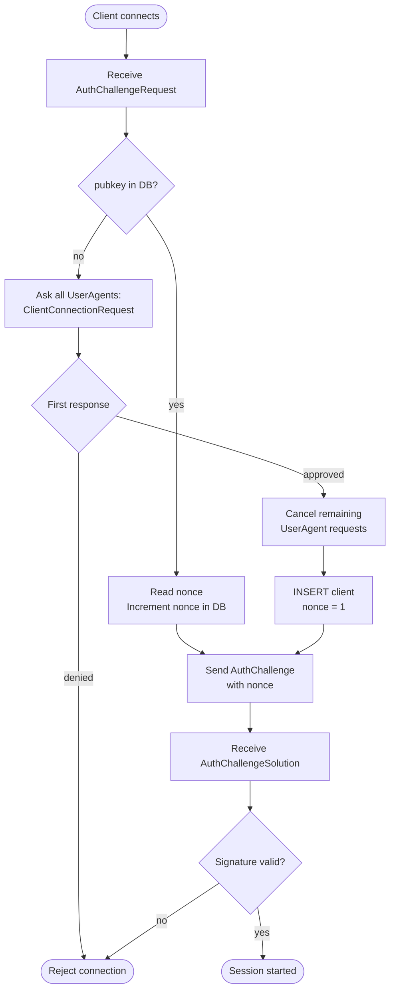

# Implementation Details

This document covers concrete technology choices and dependencies. For the architectural design, see [ARCHITECTURE.md](ARCHITECTURE.md).

---

## Client Connection Flow

### Authentication Result Semantics

Authentication no longer uses an implicit success-only response shape. Both `client` and `user-agent` return explicit auth status enums over the wire.

- **Client:** `AuthResult` may return `SUCCESS`, `INVALID_KEY`, `INVALID_SIGNATURE`, `APPROVAL_DENIED`, `NO_USER_AGENTS_ONLINE`, or `INTERNAL`
- **User-agent:** `AuthResult` may return `SUCCESS`, `INVALID_KEY`, `INVALID_SIGNATURE`, `BOOTSTRAP_REQUIRED`, `TOKEN_INVALID`, or `INTERNAL`

This makes transport-level failures and actor/domain-level auth failures distinct:

- **Transport/protocol failures** are surfaced as stream/status errors
- **Authentication failures** are surfaced as successful protocol responses carrying an explicit auth status

Clients are expected to handle these status codes directly and present the concrete failure reason to the user.

### New Client Approval

When a client whose public key is not yet in the database connects, all connected user agents are asked to approve the connection. The first agent to respond determines the outcome; remaining requests are cancelled via a watch channel.

### Known Issue: Concurrent Registration Race (TOCTOU)

Two connections presenting the same previously-unknown public key can race through the approval flow simultaneously:

1. Both check the DB → neither is registered.
2. Both request approval from user agents → both receive approval.
3. Both `INSERT` the client record → the second insert silently overwrites the first, resetting the nonce.

This means the first connection's nonce is invalidated by the second, causing its challenge verification to fail. A fix requires either serialising new-client registration (e.g. an in-memory lock keyed on pubkey) or replacing the separate check + insert with an `INSERT OR IGNORE` / upsert guarded by a unique constraint on `public_key`.

### Nonce Semantics

The `program_client.nonce` column stores the **next usable nonce** — i.e. it is always one ahead of the nonce last issued in a challenge.

- **New client:** inserted with `nonce = 1`; the first challenge is issued with `nonce = 0`.
- **Existing client:** the current DB value is read and used as the challenge nonce, then immediately incremented within the same exclusive transaction, preventing replay.

---

## Cryptography

### Authentication
- **Signature scheme:** ed25519

### Encryption at Rest
- **Scheme:** Symmetric AEAD — currently **XChaCha20-Poly1305**
- **Version tracking:** Each `aead_encrypted` database entry carries a `scheme` field denoting the version, enabling transparent migration on unseal

### Server Identity
- **Transport:** TLS with a self-signed certificate
- **Key type:** Generated on first run; long-term (no rotation mechanism yet)

---

## Communication

- **Protocol:** gRPC with Protocol Buffers
- **Request/response matching:** multiplexed over a single bidirectional stream using per-connection request IDs
- **Server identity distribution:** `ServerInfo` protobuf struct containing the TLS public key fingerprint
- **Future consideration:** grpc-web lacks bidirectional stream support, so a browser-based wallet may require protojson over WebSocket

### Request Multiplexing

Both `client` and `user-agent` connections support multiple in-flight requests over one gRPC bidi stream.

- Every request carries a monotonically increasing request ID
- Every normal response echoes the request ID it corresponds to
- Out-of-band server messages omit the response ID entirely
- The server rejects already-seen request IDs at the transport adapter boundary before business logic sees the message

This keeps request correlation entirely in transport/client connection code while leaving actor and domain handlers unaware of request IDs.

---

## EVM Policy Engine

### Overview

The EVM engine classifies incoming transactions, enforces grant constraints, and records executions. It is the sole path through which a wallet key is used for signing.

The central abstraction is the `Policy` trait. Each implementation handles one semantic transaction category and owns its own database tables for grant storage and transaction logging.

### Transaction Evaluation Flow

`Engine::evaluate_transaction` runs the following steps in order:

1. **Classify** — Each registered policy's `analyze(context)` inspects the transaction fields (`chain`, `to`, `value`, `calldata`). The first one returning `Some(meaning)` wins. If none match, the transaction is rejected as `UnsupportedTransactionType`.
2. **Find grant** — `Policy::try_find_grant` queries for a non-revoked grant covering this wallet, client, chain, and target address.
3. **Check shared constraints** — `check_shared_constraints` runs in the engine before any policy-specific logic. It enforces the validity window, gas fee caps, and transaction count rate limit (see below).
4. **Evaluate** — `Policy::evaluate` checks the decoded meaning against the grant's policy-specific constraints and returns any violations.
5. **Record** — If `RunKind::Execution` and there are no violations, the engine writes to `evm_transaction_log` and calls `Policy::record_transaction` for any policy-specific logging (e.g., token transfer volume).

### Policy Trait

| Method | Purpose |
|---|---|
| `analyze` | Pure — classifies a transaction into a typed `Meaning`, or `None` if this policy doesn't apply |
| `evaluate` | Checks the `Meaning` against a `Grant`; returns a list of `EvalViolation`s |
| `create_grant` | Inserts policy-specific rows; returns the specific grant ID |
| `try_find_grant` | Finds a matching non-revoked grant for the given `EvalContext` |
| `find_all_grants` | Returns all non-revoked grants (used for listing) |
| `record_transaction` | Persists policy-specific data after execution |

`analyze` and `evaluate` are intentionally separate: classification is pure and cheap, while evaluation may involve DB queries (e.g., fetching past transfer volume).

### Registered Policies

**EtherTransfer** — plain ETH transfers (empty calldata)

- Grant requires: allowlist of recipient addresses + one volumetric rate limit (max ETH over a time window)
- Violations: recipient not in allowlist, cumulative ETH volume exceeded

**TokenTransfer** — ERC-20 `transfer(address,uint256)` calls

- Recognised by ABI-decoding the `transfer(address,uint256)` selector against a static registry of known token contracts (`arbiter_tokens_registry`)
- Grant requires: token contract address, optional recipient restriction, zero or more volumetric rate limits
- Violations: recipient mismatch, any volumetric limit exceeded

### Grant Model

Every grant has two layers:

- **Shared (`evm_basic_grant`)** — wallet, chain, validity period, gas fee caps, transaction count rate limit. One row per grant regardless of type.
- **Specific** — policy-owned tables (`evm_ether_transfer_grant`, `evm_token_transfer_grant`, etc.) holding type-specific configuration.

`find_all_grants` uses a `#[diesel::auto_type]` base join between the specific and shared tables, then batch-loads related rows (targets, volume limits) in two additional queries to avoid N+1.

The engine exposes `list_all_grants` which collects across all policy types into `Vec<Grant<SpecificGrant>>` via a blanket `From<Grant<S>> for Grant<SpecificGrant>` conversion.

### Shared Constraints (enforced by the engine)

These are checked centrally in `check_shared_constraints` before policy evaluation:

| Constraint | Fields | Behaviour |
|---|---|---|
| Validity window | `valid_from`, `valid_until` | Emits `InvalidTime` if current time is outside the range |
| Gas fee cap | `max_gas_fee_per_gas`, `max_priority_fee_per_gas` | Emits `GasLimitExceeded` if either cap is breached |
| Tx count rate limit | `rate_limit` (`count` + `window`) | Counts rows in `evm_transaction_log` within the window; emits `RateLimitExceeded` if at or above the limit |

---

### Known Limitations

- **Only EIP-1559 transactions are supported.** Legacy and EIP-2930 types are rejected outright.
- **No opaque-calldata (unknown contract) grant type.** The architecture describes a category for unrecognised contracts, but no policy implements it yet. Any transaction that is not a plain ETH transfer or a known ERC-20 transfer is unconditionally rejected.
- **Token registry is static.** Tokens are recognised only if they appear in the hard-coded `arbiter_tokens_registry` crate. There is no mechanism to register additional contracts at runtime.
- **Nonce management is not implemented.** The architecture lists nonce deduplication as a core responsibility, but no nonce tracking or enforcement exists yet.

---

## Memory Protection

The unsealed root key must be held in a hardened memory cell resistant to dumps, page swaps, and hibernation.

- **Current:** Using the `memsafe` crate as an interim solution
- **Planned:** Custom implementation based on `mlock` (Unix) and `VirtualProtect` (Windows)
