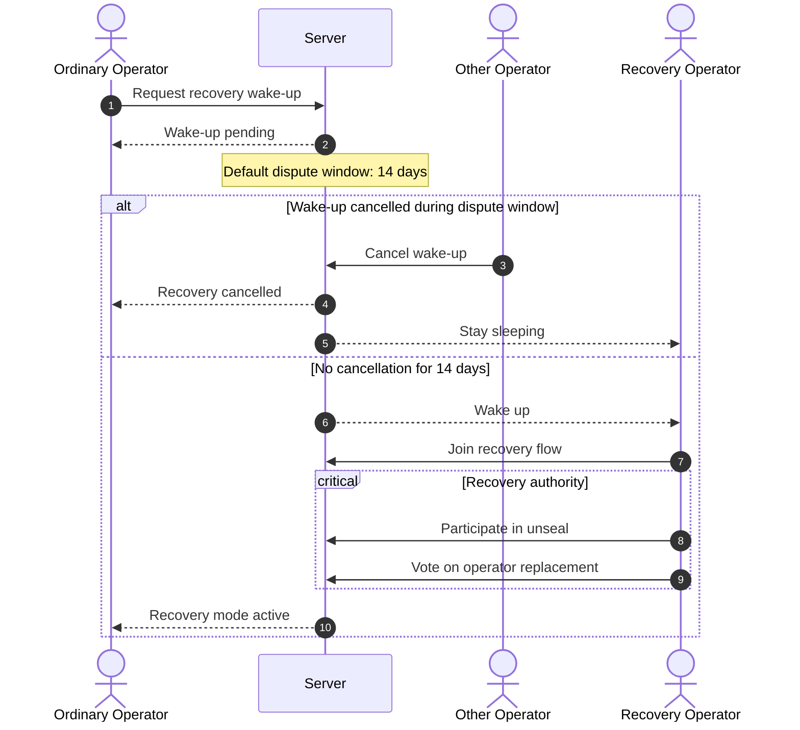
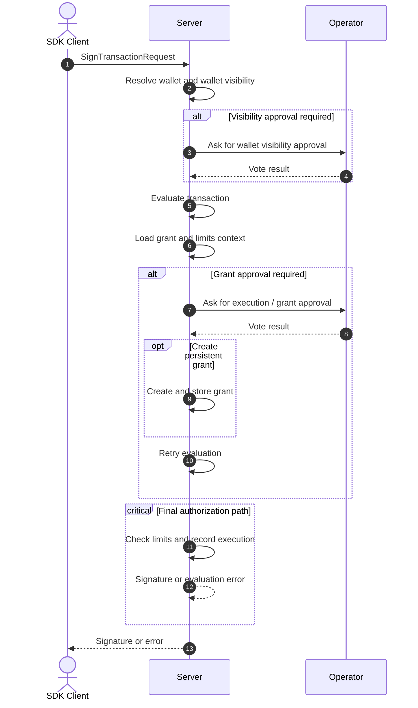

# Arbiter

Arbiter is a permissioned signing service for cryptocurrency wallets. It runs as a background service on the user's machine with an optional client application for vault management.

**Core principle:** The vault NEVER exposes key material. It only produces signatures when a request satisfies the configured policies.
---

## 1. Peer Types

Arbiter distinguishes two kinds of peers:

- **Operator** — A client application used by the owner to manage the vault (create wallets, approve SDK clients, configure policies).
- **SDK Client** — A consumer of signing capabilities, typically an automation tool. In the future, this could include a browser-based wallet.
- **Recovery Operator** — A dormant recovery participant with narrowly scoped authority used only for custody recovery and operator replacement.

---

## 2. Authentication

### 2.1 Challenge-Response

All peers authenticate via public-key cryptography using a challenge-response protocol:

1. The peer sends its public key and requests a challenge.
2. The server looks up the key in its database. If found, it generates a fresh challenge from random bytes plus the current timestamp.
3. The peer signs the canonical challenge payload with its private key and sends the signature back.
4. The server verifies the signature:
   - **Pass:** The connection is considered authenticated.
   - **Fail:** The server closes the connection.

Authentication challenges are per-connection, ephemeral values. They are not persisted in the peer tables, and peer records store no challenge state.

### 2.2 Operator Bootstrap

On first run — when no Operators are registered — the server generates a one-time bootstrap token. It is made available in two ways:

- **Local setup:** Written to `~/.arbiter/bootstrap_token` for automatic discovery by a co-located Operator.
- **Remote setup:** Printed to the server's console output.

The first Operator must present this token alongside the standard challenge-response to complete registration.

### 2.3 SDK Client Registration

There is no bootstrap mechanism for SDK clients. They must be explicitly approved by an already-registered Operator.

---

## 3. Multi-Operator Governance

When more than one Operator is registered, the vault is treated as having multiple operators. In that mode, sensitive actions are governed by voting rather than by a single operator decision.

### 3.1 Voting Rules

Voting is based on the total number of registered operators:

- **1 operator:** no vote is needed; the single operator decides directly.
- **2 operators:** full consensus is required; both operators must approve.
- **3 or more operators:** quorum is `floor(N / 2) + 1`.

For a decision to count, the operator's approval or rejection must be signed by that operator's associated key. Unsigned votes, or votes that fail signature verification, are ignored.

Examples:

- **3 operators:** 2 approvals required
- **4 operators:** 3 approvals required

### 3.2 Actions Requiring a Vote

In multi-operator mode, a successful vote is required for:

- approving new SDK clients
- granting an SDK client visibility to a wallet
- approving a one-off transaction
- approving creation of a persistent grant
- approving operator replacement
- approving server updates
- updating Shamir secret-sharing parameters

### 3.3 Special Rule for Key Rotation

Key rotation always requires full quorum, regardless of the normal voting threshold.

This is stricter than ordinary governance actions because rotating the root key requires every operator to participate in coordinated share refresh/update steps. The root key itself is not redistributed directly, but each operator's share material must be changed consistently.

### 3.4 Root Key Custody

When the vault has multiple operators, the vault root key is protected using Shamir secret sharing.

The vault root key is encrypted in a way that requires reconstruction from user-held shares rather than from a single shared password.

For ordinary operators, the Shamir threshold matches the ordinary governance quorum. For example:

- **2 operators:** `2-of-2`
- **3 operators:** `2-of-3`
- **4 operators:** `3-of-4`

In practice, the Shamir share set also includes Recovery Operator shares. This means the effective Shamir parameters are computed over the combined share pool while keeping the same threshold. For example:

- **3 ordinary operators + 2 recovery shares:** `2-of-5`

This ensures that the normal custody threshold follows the ordinary operator quorum, while still allowing dormant recovery shares to exist for break-glass recovery flows.

### 3.5 Recovery Operators

Recovery Operators are a separate peer type from ordinary vault operators.

Their role is intentionally narrow. They can only:

- participate in unsealing the vault
- vote for operator replacement

Recovery Operators do not participate in routine governance such as approving SDK clients, granting wallet visibility, approving transactions, creating grants, approving server updates, or changing Shamir parameters.

### 3.6 Sleeping and Waking Recovery Operators

By default, Recovery Operators are **sleeping** and do not participate in any active flow.

Any ordinary operator may request that Recovery Operators **wake up**.

Any ordinary operator may also cancel a pending wake-up request.

This creates a dispute window before recovery powers become active. The default wake-up delay is **14 days**.

Recovery Operators are therefore part of the break-glass recovery path rather than the normal operating quorum.

The high-level recovery flow is:

### 3.7 Committee Formation

There are two ways to form a multi-operator committee:

- convert an existing single-operator vault by adding new operators
- bootstrap an unbootstrapped vault directly into multi-operator mode

In both cases, committee formation is a coordinated process. Arbiter does not allow multi-operator custody to emerge implicitly from unrelated registrations.

### 3.8 Bootstrapping an Unbootstrapped Vault into Multi-Operator Mode

When an unbootstrapped vault is initialized as a multi-operator vault, the setup proceeds as follows:

1. An operator connects to the unbootstrapped vault using an Operator and the bootstrap token.
2. During bootstrap setup, that operator declares:
   - the total number of ordinary operators
   - the total number of Recovery Operators
3. The vault enters **multi-bootstrap mode**.
4. While in multi-bootstrap mode:
   - every ordinary operator must connect with an Operator using the bootstrap token
   - every Recovery Operator must also connect using the bootstrap token
   - each participant is registered individually
   - each participant's share is created and protected with that participant's credentials
5. The vault is considered fully bootstrapped only after all declared operator and recovery-share registrations have completed successfully.

This means the operator and recovery set is fixed at bootstrap completion time, based on the counts declared when multi-bootstrap mode was entered.

### 3.9 Special Bootstrap Constraint for Two-Operator Vaults

If a vault is declared with exactly **2 ordinary operators**, Arbiter requires at least **1 Recovery Operator** to be configured during bootstrap.

This prevents the worst-case custody failure in which a `2-of-2` operator set becomes permanently unrecoverable after loss of a single operator.

---

## 4. Server Identity

The server proves its identity using TLS with a self-signed certificate. The TLS private key is generated on first run and is long-term; no rotation mechanism exists yet due to the complexity of multi-peer coordination.

Peers verify the server by its **public key fingerprint**:

- **Operator (local):** Receives the fingerprint automatically through the bootstrap token.
- **Operator (remote) / SDK Client:** Must receive the fingerprint out-of-band.

> A streamlined setup mechanism using a single connection string is planned but not yet implemented.

---

## 5. Key Management

### 5.1 Key Hierarchy

There are three layers of keys:

| Key | Encrypts | Encrypted by |
|---|---|---|
| **User key** (password) | Root key | — (derived from user input) |
| **Root key** | Wallet keys | User key |
| **Wallet keys** | — (used for signing) | Root key |

This layered design enables:

- **Password rotation** without re-encrypting every wallet key (only the root key is re-encrypted).
- **Root key rotation** without requiring the user to change their password.

### 5.2 Encryption at Rest

The database stores everything in encrypted form using symmetric AEAD. The encryption scheme is versioned to support transparent migration — when the vault unseals, Arbiter automatically re-encrypts any entries that are behind the current scheme version. See [IMPLEMENTATION.md](IMPLEMENTATION.md) for the specific scheme and versioning mechanism.

---

## 6. Vault Lifecycle

### 6.1 Sealed State

On boot, the root key is encrypted and the server cannot perform any signing operations. This state is called **Sealed**.

### 6.2 Unseal Flow

To transition to the **Unsealed** state, an Operator must provide the password:

1. The Operator initiates an unseal request.
2. The server generates a one-time key pair and returns the public key.
3. The Operator encrypts the user's password with this one-time public key and sends the ciphertext to the server.
4. The server decrypts and verifies the password:
   - **Success:** The root key is decrypted and placed into a hardened memory cell. The server transitions to `Unsealed`. Any entries pending encryption scheme migration are re-encrypted.
   - **Failure:** The server returns an error indicating the password is incorrect.

### 6.3 Memory Protection

Once unsealed, the root key must be protected in memory against:

- Memory dumps
- Page swaps to disk
- Hibernation files

See [IMPLEMENTATION.md](IMPLEMENTATION.md) for the current and planned memory protection approaches.

---

## 7. Permission Engine

### 7.1 Fundamental Rules

- SDK clients have **no access by default**.
- Access is granted **explicitly** by an Operator.
- Grants are scoped to **specific wallets** and governed by **policies**.

Each blockchain requires its own policy system due to differences in static transaction analysis. Currently, only EVM is supported; Solana support is planned.

Arbiter is also responsible for ensuring that **transaction nonces are never reused**.

### 7.2 EVM Policies

Every EVM grant is scoped to a specific **wallet** and **chain ID**.

#### 7.2.0 Transaction Signing Sequence

The high-level interaction order is:

#### 7.2.1 Transaction Sub-Grants

Arbiter maintains an ever-expanding database of known contracts and their ABIs. Based on contract knowledge, transaction requests fall into three categories:

**1. Known contract (ABI available)**

The transaction can be decoded and presented with semantic meaning. For example: *"Client X wants to transfer Y USDT to address Z."*

Available restrictions:
- Volume limits (e.g., "no more than 10,000 tokens ever")
- Rate limits (e.g., "no more than 100 tokens per hour")

**2. Unknown contract (no ABI)**

The transaction cannot be decoded, so its effects are opaque — it could do anything, including draining all tokens. The user is warned, and if approved, access is granted to all interactions with the contract (matched by the `to` field).

Available restrictions:
- Transaction count limits (e.g., "no more than 100 transactions ever")
- Rate limits (e.g., "no more than 5 transactions per hour")

**3. Plain ether transfer (no calldata)**

These transactions have no `calldata` and therefore cannot interact with contracts. They can be subject to the same volume and rate restrictions as above.

#### 7.2.2 Global Limits

In addition to sub-grant-specific restrictions, the following limits can be applied across all grant types:

- **Gas limit** — Maximum gas per transaction.
- **Time-window restrictions** — e.g., signing allowed only 08:00–20:00 on Mondays and Thursdays.
